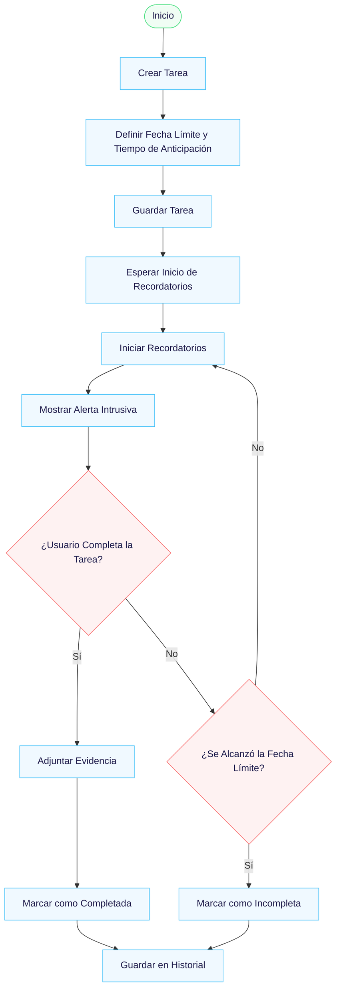

# Reminder-NoEscape.

Reminder: No Escape es una aplicación de recordatorios diseñada para personas con dificultades para mantener la concentración o cumplir tareas dentro de un plazo determinado.

La aplicación permite al usuario crear tareas con un título, descripción y una fecha límite, estableciendo el momento máximo en el que desea completar dicha actividad.

Además, el usuario puede definir un tiempo de anticipación, es decir, desde cuándo desea que comiencen los recordatorios antes de la fecha límite.

Por ejemplo, si una tarea tiene como límite las 16:00, el usuario puede configurar que los recordatorios comiencen desde las 13:00, generando un margen de tiempo para completar la actividad.

A diferencia de las aplicaciones tradicionales, este sistema implementa recordatorios persistentes e intrusivos, que se activan dentro de este rango de tiempo definido, repitiéndose constantemente hasta que la tarea sea completada o se alcance la fecha límite.

## ⚙️ Características propias del móvil.

La aplicación hace uso de funcionalidades propias de dispositivos móviles, tales como:

- 📲 Notificaciones persistentes incluso cuando el dispositivo no está en uso
- 🖥️ Alertas en pantalla completa que interrumpen la actividad del usuario
- ⏰ Temporizadores dinámicos basados en el tiempo restante
- 🔔 Sonido, vibración y elementos visuales personalizados
- 📷 Uso de la cámara para validar cumplimiento de tareas mediante evidencia
- 📱 Uso continuo del dispositivo: aprovechamiento del hábito de uso del smartphone

## 👤 Historias de usuario.

- Como usuario, quiero crear tareas con fecha límite para organizarme.
- Como usuario, quiero recibir recordatorios constantes para no olvidar mis tareas.
- Como usuario, quiero configurar la frecuencia de los recordatorios.
- Como usuario, quiero que los recordatorios sean difíciles de ignorar.
- Como usuario, quiero marcar tareas como completadas con evidencia (imagen).
- Como usuario, quiero que la app registre si cumplí o no una tarea.
- Como usuario, quiero definir desde cuándo comienzan los recordatorios antes de la fecha límite.

## ✅ Requerimientos funcionales. (RF)

- RF1: El sistema debe permitir crear tareas con título, descripción y fecha límite.
- RF2: El sistema debe activar recordatorios al acercarse la fecha límite.
- RF3: El sistema debe mostrar alertas en pantalla completa por un tiempo definido.
- RF4: El sistema debe permitir configurar la frecuencia de los recordatorios.
- RF5: El sistema debe soportar modo de frecuencia dinámica.
- RF6: El sistema debe permitir adjuntar una imagen como evidencia de cumplimiento.
- RF7: El sistema debe marcar tareas como completadas o incompletas automáticamente.
- RF8: El sistema debe repetir recordatorios hasta que se cumpla una condición de término.
- RF9: El sistema debe permitir configurar un tiempo de anticipación para el inicio de los recordatorios.

## ⚠️ Requerimientos no funcionales. (RNF)

- RNF1: La aplicación debe ser intuitiva pese a su comportamiento intrusivo.
- RNF2: Las notificaciones deben ejecutarse en tiempo real sin retrasos.
- RNF3: El consumo de batería debe ser controlado.
- RNF4: La aplicación debe ser estable ante múltiples recordatorios activos.
- RNF5: La app debe mantener un equilibrio entre insistencia y usabilidad.

## 🔄 Diagrama de flujo.

## 🔍 Investigación
**Documento de investigación:**
👉 [RESEARCH.md](RESEARCH.md)
