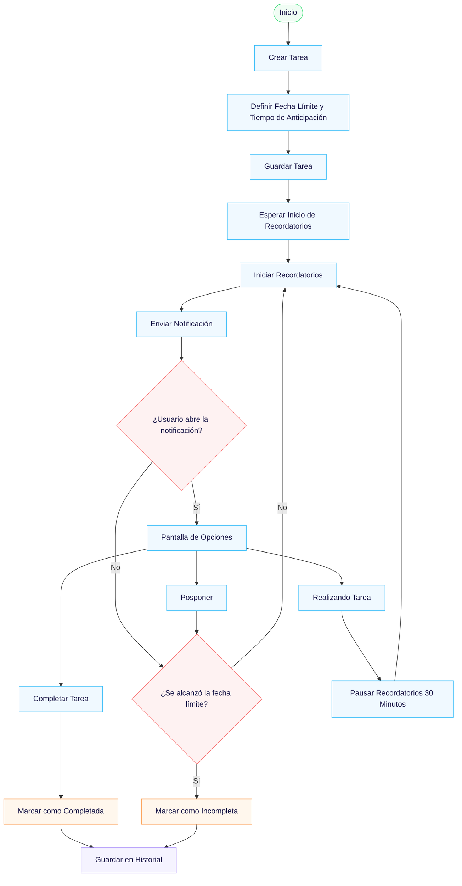
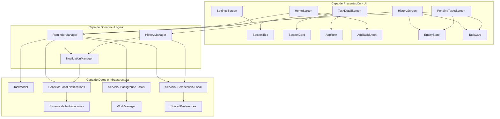
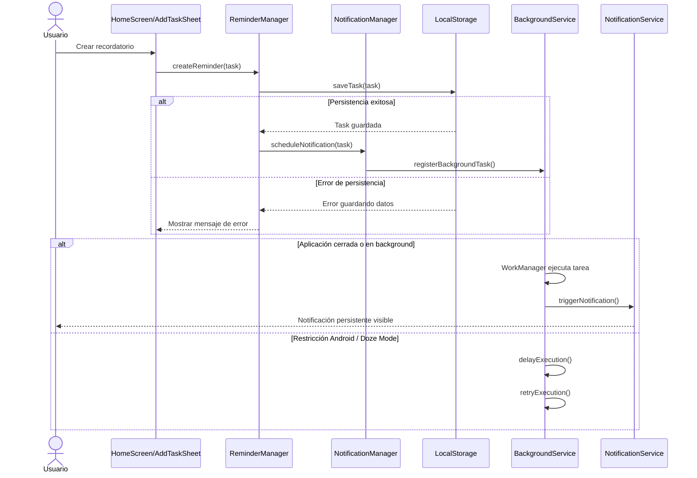
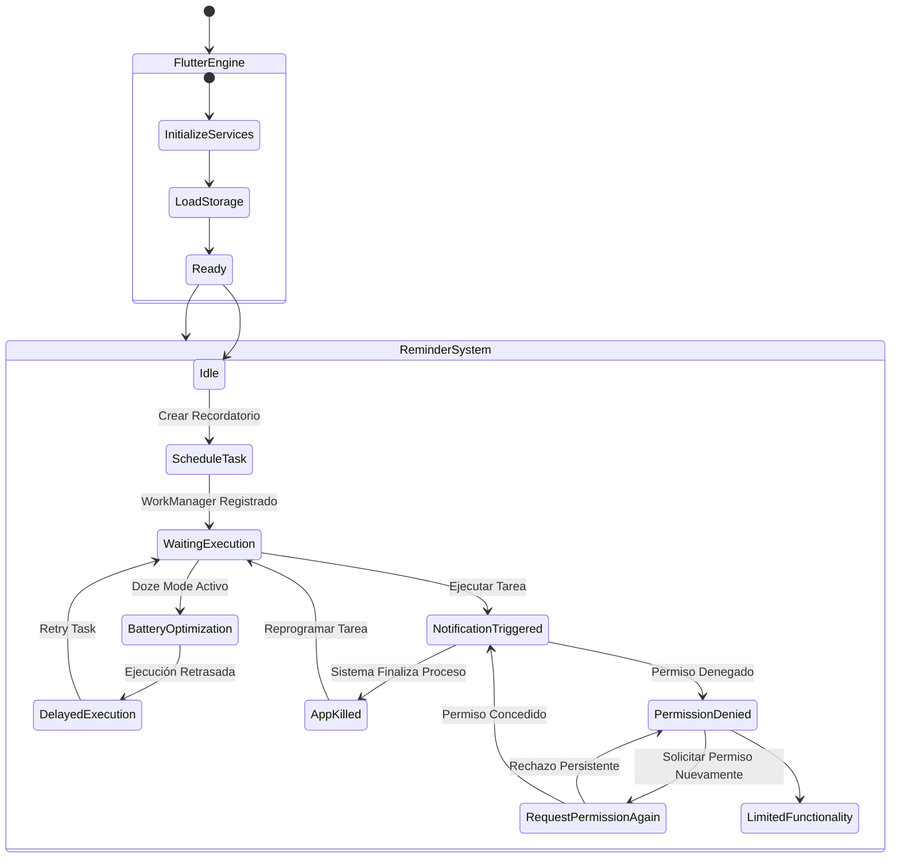

# Reminder-NoEscape.

Reminder: No Escape es una aplicación de recordatorios diseñada para ayudar a los usuarios a cumplir tareas importantes mediante un sistema de notificaciones persistentes. La aplicación permite crear tareas con una fecha límite y configurar cuándo deben comenzar los recordatorios. A diferencia de las aplicaciones tradicionales, los recordatorios se repiten constantemente dentro del período definido por el usuario hasta que la tarea sea completada o alcance su fecha límite, reduciendo la probabilidad de que actividades importantes sean olvidadas.

## ⚙️ Características propias del móvil.

La aplicación hace uso de funcionalidades propias de dispositivos móviles, tales como:

- 📲 Notificaciones persistentes incluso cuando el dispositivo no está en uso
- 🖥️ Alertas en pantalla completa que interrumpen la actividad del usuario
- ⏰ Temporizadores dinámicos basados en el tiempo restante
- 🔔 Sonido y elementos visuales personalizados
- 📱 Uso continuo del dispositivo: aprovechamiento del hábito de uso del smartphone

## 📖 Intrucciones de uso.

### 🟢 1. Crear una tarea
- Presiona el botón flotante.
- Ingresa:
  - Título de la tarea
  - Descripción
  - Fecha y hora límite
  - Tiempo de anticipación (inicio de recordatorios)
  - tiempo de intervalo (tiempo de repeticion de notificaciones)
- Guarda la tarea.

### ⏰ 2. Activación de recordatorios
- Cuando se alcanza el tiempo de anticipación, la aplicación comienza a enviar recordatorios.
- Estos pueden ser:
  - 🔔 Notificaciones (si estás usando el dispositivo)
  - 🖥️ Alertas intrusivas en pantalla completa (si no estás usando el dispositivo)
 
### 🔁 3. Frecuencia de recordatorios
- Puedes configurar cada cuánto tiempo deseas recibir recordatorios al momento de crear la tarea de manera 100% personalizada
 
### 🧠 4. Modo “Realizando tarea”
- Desde la notificación intrusiva, el usuario puede seleccionar “Realizando tarea”.
- Esto activa un modo de concentración donde:
  - Se detienen temporalmente los recordatorios constantes
  - Se asume que el usuario está trabajando en la tarea

### ⏳ 5. Verificación de progreso
- Después de un tiempo determinado (30 minutos), la aplicación volvera a mandar notificaciones para que el usuario presione la notificacion y lo lleve a una pantalla con opciones.
  
El usuario puede:
- ⏰ realizando tarea → se mantiene el modo concentración
- ✔ completar tarea → se completa la tarea y se detienen los recordatorios
- ❌ posponer o ignorar → se reactivan los recordatorios insistentes
 
### ✅ 6. Finalización de tarea
- El usuario puede completar la tarea en cualquier momento:
  - Marcándola como realizada
👉 Esto detiene inmediatamente los recordatorios.

### ❌ 7. Tarea incompleta
- Si se alcanza la fecha límite sin completar la tarea:
  - Se marca automáticamente como incompleta
  - Se guarda en el historial
 
### 📊 8. Historial
- Accede al historial desde la pantalla principal.
- Podrás ver:
  - Tareas completadas
  - Tareas no completadas
 
### ⚙️ 9. Configuración
- Ajusta:
  - Idioma
  - Tema
  - Sonido
  - duracion de alerta (tiempo en el que la pantalla de los botones de opciones se mantiene bloqueado)

## 👤 Historias de usuario.

- Como usuario, quiero crear tareas con fecha límite para organizarme.
- Como usuario, quiero recibir recordatorios constantes para no olvidar mis tareas.
- Como usuario, quiero configurar la frecuencia de los recordatorios.
- Como usuario, quiero que los recordatorios sean difíciles de ignorar.
- Como usuario, quiero marcar tareas como completadas.
- Como usuario, quiero que la app registre si cumplí o no una tarea.
- Como usuario, quiero definir desde cuándo comienzan los recordatorios antes de la fecha límite.

## ✅ Requerimientos funcionales. (RF)

- RF1: El sistema debe permitir crear tareas con título, descripción y fecha límite.
- RF2: El sistema debe activar recordatorios al acercarse la fecha límite.
- RF3: El sistema debe mostrar alertas en pantalla completa por un tiempo definido.
- RF4: El sistema debe permitir configurar la frecuencia de los recordatorios.
- RF5: El sistema debe soportar modo de frecuencia dinámica.
- RF6: El sistema debe permitir adjuntar una imagen como evidencia de cumplimiento.
- RF7: El sistema debe marcar tareas como completadas o incompletas automáticamente.
- RF8: El sistema debe repetir recordatorios hasta que se cumpla una condición de término.
- RF9: El sistema debe permitir configurar un tiempo de anticipación para el inicio de los recordatorios.

## ⚠️ Requerimientos no funcionales. (RNF)

- RNF1: La aplicación debe ser intuitiva pese a su comportamiento intrusivo.
- RNF2: Las notificaciones deben ejecutarse en tiempo real sin retrasos.
- RNF3: El consumo de batería debe ser controlado.
- RNF4: La aplicación debe ser estable ante múltiples recordatorios activos.
- RNF5: La app debe mantener un equilibrio entre insistencia y usabilidad.

## 🔄 Diagrama de flujo.

# Modelo Estructural del Proyecto

# Modelo de Comportamiento

# Diagrama de Máquina de Estado

# Análisis de Dependencias 
Se muestran las dependencias utilizadas en la aplicacion para su correcto funcionamiento
| Mecanismo | Librería | Rol |
|---|---|---|
| Notificaciones exactas programadas | `flutter_local_notifications ^18.0.1` | Disparo primario por `AndroidFlutterLocalNotificationsPlugin.zonedSchedule()` |
| Reintento en background vía WorkManager | `workmanager ^0.5.2` | Tarea periódica de rescate cuando el proceso principal es eliminado |
| Gestión de zonas horarias | `flutter_timezone ^1.0.9` + `timezone ^0.9.4` | Mantener consistencia horaria en zonas horarias locales |
| Persistencia del estado de tareas | `shared_preferences ^2.3.2` | Registro local de tareas pendientes accesible desde el worker de background |
| Gestión de permisos en runtime | `permission_handler ^11.3.1` | Solicitar `SCHEDULE_EXACT_ALARM`, `POST_NOTIFICATIONS` y `IGNORE_BATTERY_OPTIMIZATIONS` |
| Intent del sistema Android | `android_intent_plus ^5.0.2` | Redirigir al usuario a la pantalla de permisos especiales del sistema cuando se detecta restricción de batería |
# Reporte de QA (Beta Testing)
## 1. Análisis Realizado
El proceso de evaluación se llevó a cabo mediante un formulario de valoración integrado en la aplicación. Un total de 14 usuarios evaluaron el prototipo funcional de Reminder: No Escape considerando aspectos relacionados con la usabilidad, claridad del contenido y aceptación de la solución. En términos generales, la aplicación obtuvo una recepción positiva, validando la propuesta de valor basada en recordatorios persistentes para mejorar el cumplimiento de tareas importantes.
## 2. Metodología y Muestra
La evaluación fue realizada mediante un cuestionario compuesto por 9 preguntas distribuidas en tres categorías: usabilidad, contenido y recomendación de la aplicación. Los usuarios respondieron utilizando una escala de valoración de 1 a 5 estrellas.

Las muestras fueron obtenidas de la siguiente forma:

Participantes de la iniciativa "Digital Workspace Mobility": 10 usuarios.
Conocedores de la industria: 2 usuarios.
Usuarios externos a la industria: 2 usuarios.

Total de participantes: 14 usuarios.
## 3. Matriz de Resultados Cuantitativos
Para facilitar el análisis, se calcularon las puntuaciones medias (escala de 1 a 5) obtenidas en cada pregunta evaluada durante el proceso de beta testing.
| Categoría | Criterio / Pregunta | Puntuación Promedio |
|-----------|---------------------|---------------------|
| **Usabilidad** | ¿Qué tan fácil fue crear y configurar un nuevo recordatorio? | **4.8 / 5.0** |
| | ¿Qué tan fácil fue navegar entre las secciones de la aplicación? | **4.6 / 5.0** |
| | ¿Cómo calificas la interfaz visual de la aplicación en términos de diseño y claridad? | **4.7 / 5.0** |
| **Contenido** | ¿La aplicación cumplió adecuadamente su propósito de ayudarte a recordar tareas importantes? | **4.6 / 5.0** |
| | ¿Qué tan útil consideras la función de recordatorios persistentes? | **4.5 / 5.0** |
| | ¿La información mostrada en la aplicación es clara y fácil de comprender? | **4.5 / 5.0** |
| **Compartir / Recomendación** | ¿Qué tan probable es que recomiendes Reminder: No Escape a alguien que necesite organizarse mejor? | **4.6 / 5.0** |
| | ¿Crees que el enfoque de alertas insistentes es una solución efectiva para personas que olvidan sus tareas con frecuencia? | **4.5 / 5.0** |
| | ¿Considerarías usar Reminder: No Escape como tu aplicación principal para gestionar recordatorios importantes? | **4.5 / 5.0** |
# 4. Análisis de los Hallazgos
A. ¿Qué fue lo que funcionó?

Usabilidad de la Aplicación: Los usuarios destacaron la facilidad para crear, administrar y visualizar tareas dentro de la aplicación, obteniendo una valoración promedio de 4.7 sobre 5.

Claridad del Contenido: La información relacionada con tareas, recordatorios y configuraciones fue considerada clara y comprensible, alcanzando una puntuación promedio de 4.5 sobre 5.

Aceptación de la Solución: Los participantes valoraron positivamente el sistema de recordatorios persistentes, indicando que recomendarían la aplicación a otras personas que tengan dificultades para cumplir tareas importantes.

B. ¿Qué falló?

Gestión de Recordatorios en Segundo Plano: Algunos usuarios reportaron comportamientos inconsistentes en la recepción de notificaciones bajo determinadas configuraciones del sistema operativo Android, especialmente relacionadas con restricciones de batería y ejecución en segundo plano.
# 5. Technical Debt (Trabajos Futuros)
Para futuras iteraciones del proyecto se identificaron las siguientes mejoras prioritarias:

Optimización de Recordatorios Persistentes

Continuar mejorando la confiabilidad de las notificaciones en dispositivos con restricciones agresivas de batería o procesos en segundo plano, asegurando una mayor consistencia entre diferentes versiones de Android.

Ampliación de Estadísticas

Incorporar métricas más detalladas sobre productividad, cumplimiento de tareas y tendencias de uso para proporcionar información más útil al usuario.

Sincronización y Respaldo

Evaluar la incorporación de mecanismos de respaldo o sincronización en la nube para evitar la pérdida de información y facilitar la migración entre dispositivos.

## 🤖 APK
[APK](https://drive.google.com/file/d/1BYFyZUPmNDnez9XcpWb1wGOBAIkeHDIm/view?usp=sharing)

## 🔍 Investigación
**Documento de investigación:**
👉 [RESEARCH.md](RESEARCH.md)
